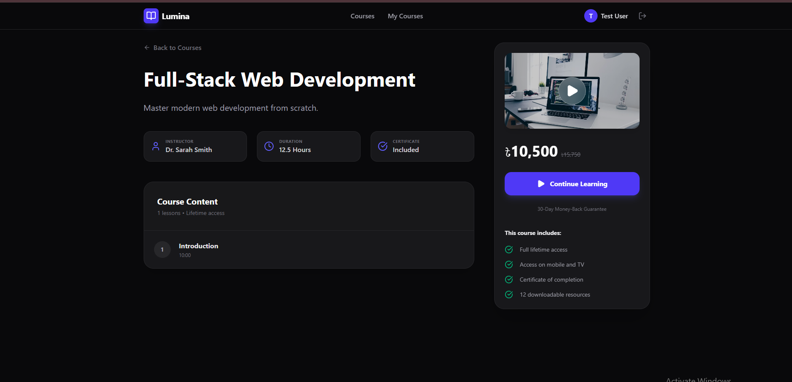
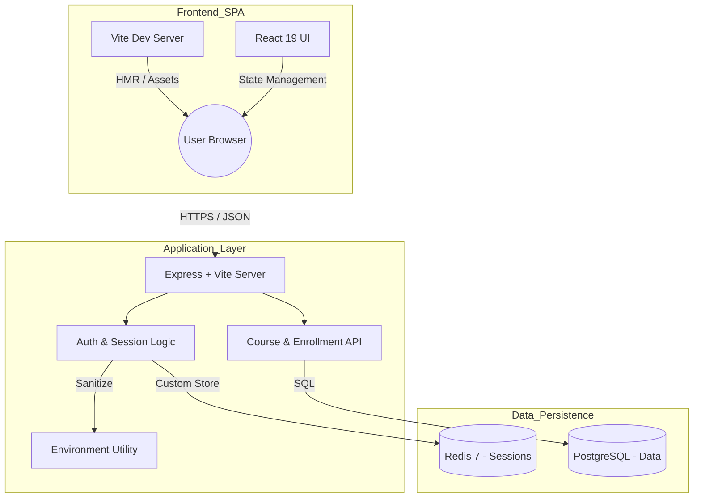
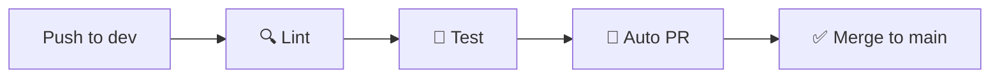
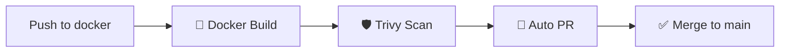
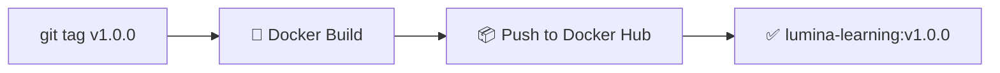
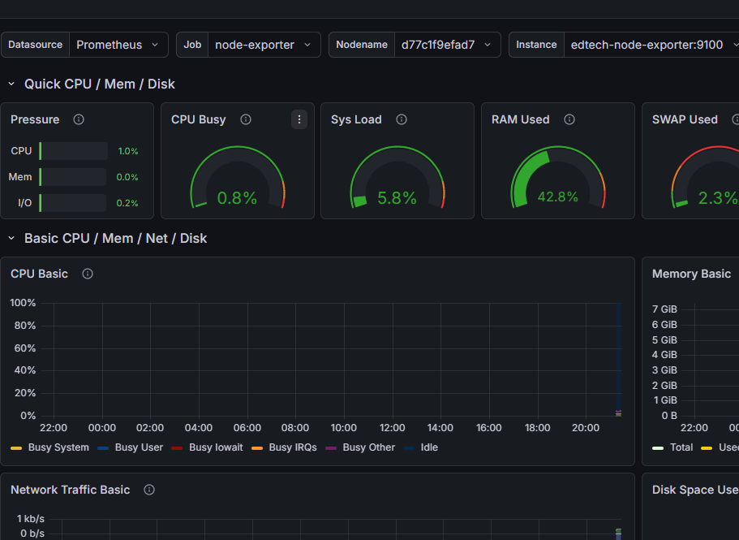
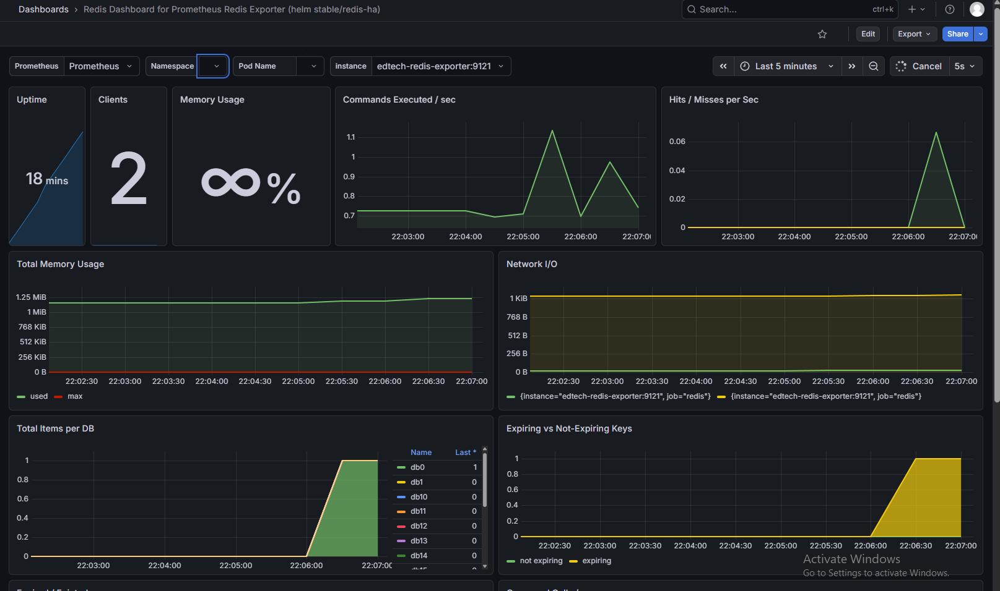

<div align="center">


# Lumina Learning

### A full-stack EdTech platform — vibe coded for learning, built with real-world architecture.

[](https://react.dev/)
[](https://expressjs.com/)
[](https://www.postgresql.org/)
[](https://redis.io/)
[](https://docs.docker.com/compose/)
[](https://vitejs.dev/)
[](#)

</div>

---

> ⚠️ **Disclaimer:** This is a personal **learning & practice project**, vibe coded to explore full-stack development.
> Not affiliated with, endorsed by, or connected to [luminalearning.com](https://luminalearning.com) in any way.

---

## Table of Contents

- [Overview](#overview)
- [Screenshots](#screenshots)
- [Tech Stack](#tech-stack)
- [Architecture](#architecture)
- [Key Features](#key-features)
- [Security](#security)
- [Redis & Session Management](#redis--session-management)
- [Search & Discovery](#search--discovery)
- [Getting Started](#getting-started)
- [Diagnostics & Inspection](#diagnostics--inspection)
- [CI/CD Pipeline](#cicd-pipeline)
- [Observability](#observability)
- [Contributing](#contributing)

---

## Overview

**Lumina Learning** is a vibe-coded, full-stack EdTech platform built purely for learning purposes. The goal was simple — take a real-world project idea and build it properly, with production-grade patterns: Redis sessions, Docker containerization, secure auth, and a dynamic React frontend.

No shortcuts. No tutorials copy-pasted. Just vibes, curiosity, and a lot of debugging. 🚀

---
## Screenshots

### 🏠 Home — Course Discovery





> Dark-themed dashboard with real-time course search, category badges, ratings, and pricing. Logged in as **Test User** with instant access to enrolled courses.

---

### 🎓 Certificate of Achievement

> Auto-generated **Certificate of Achievement** issued on course completion — includes course name, student name, issue date, verified badge, and dual signatures from Lead Instructor & Director of Education.

---

## Tech Stack

| Layer | Technology |
|---|---|
| **Frontend** | React 19, Vite (HMR + Asset Bundling) |
| **Backend** | Node.js, Express |
| **Database** | PostgreSQL (primary data store) |
| **Cache / Sessions** | Redis 7 |
| **Containerization** | Docker & Docker Compose |
| **Auth** | bcryptjs, express-session, Custom Redis Store |

---

## Architecture


---

## Key Features

### ⚡ Custom Redis Session Store

Standard session libraries (e.g., `connect-redis`) fail to communicate correctly with Redis 7 in Docker environments, producing `ERR syntax error` at runtime.

**Solution:** A fully custom Redis Session Store was implemented directly in the backend, using native Redis commands (`SET key value EX seconds`) rather than library abstractions.

**Result:**
- ✅ 100% compatibility with Redis 7
- ✅ Zero session-save failures
- ✅ Full control over TTL and serialization

---

### 🐳 Docker Environment Hardening

Docker environments can silently introduce bugs when `.env` files contain literal quote characters in connection strings, causing the app to fail on startup.

**Solution:** A `cleanEnv` utility automatically sanitizes all configuration strings — `DATABASE_URL`, `REDIS_URL`, etc. — before the application consumes them.

**Result:**
- ✅ Prevents malformed connection strings
- ✅ Works reliably across all host environments
- ✅ Zero manual debugging of quote-escaping issues

---

### 🔄 Auto-Login on Registration

Instead of leaking a `"User already exists"` error (which enables account enumeration attacks), the auth layer intelligently detects an existing account and logs the user in silently.

**Result:**
- ✅ Improved security posture — no account enumeration
- ✅ Better UX — no confusing errors on duplicate registration

---

## Security

Security is baked into the core of the application, not added as an afterthought.

| Threat | Mitigation |
|---|---|
| **Plaintext passwords** | `bcryptjs` hashing with salt factor 10 — raw passwords are never stored |
| **XSS cookie theft** | `httpOnly: true` on all session cookies |
| **CSRF attacks** | `sameSite: "lax"` on all session cookies |
| **Session forgery** | Sessions signed with a 64-character hex `SESSION_SECRET` |
| **SQL Injection** | Parameterized queries (PostgreSQL) & prepared statements (SQLite) |
| **Stale sessions** | `maxAge` of 7 days with automatic TTL expiration enforced in Redis |
| **Secret rotation** | Rotating `SESSION_SECRET` instantly invalidates all active sessions |

> **Note:** Rotating `SESSION_SECRET` is a hard logout for all users. This is intentional behavior for incident response.

---

## Redis & Session Management

Redis serves as the **short-term memory** of the application — purpose-built for fast session lookups and stateless horizontal scaling.

### Authentication Flow
```
1.  User submits credentials  →  POST /api/auth/login
2.  Server validates password against PostgreSQL (bcrypt compare)
3.  Server generates a unique Session ID (sid)
4.  Server stores { userId: 1 } in Redis  →  key: sess:<sid>
5.  Server sends sid to browser in a signed, HttpOnly cookie
6.  On every subsequent request:
        Browser sends cookie
          → Server reads sid
          → Server fetches userId from Redis  (sub-millisecond)
          → Request is authenticated ✓
```

### Session Lifecycle

| Property | Value |
|---|---|
| **Storage backend** | Redis 7 (persists across server restarts) |
| **TTL** | 7 days, calculated manually by `CustomRedisStore` |
| **Key format** | `sess:<sessionId>` |
| **Scaling model** | Stateless — supports horizontal scaling behind a load balancer |
| **Lookup latency** | Sub-millisecond |

---

## Search & Discovery

The platform features a **dynamic, real-time course search** built entirely on the client — no page reloads, no server round-trips.

### How It Works
```
User types in search box
        ↓
Client-side filter executes on `courses` state (zero API calls)
        ↓
Algorithm scans: Title · Description · Category
        ↓
Results update instantly on every keystroke
```

### Capabilities

- **Real-time filtering** — results appear as you type
- **Multi-field matching** — searches title, description, and category simultaneously
- **Case-insensitive** — `React` matches `react`, `REACT`, and `ReAcT`
- **Zero-state handling** — a dedicated "No results found" view renders when the query returns nothing

---

## Getting Started

### Prerequisites

- [Docker](https://www.docker.com/get-started) & Docker Compose
- [Node.js](https://nodejs.org/) v18+ (for local development without Docker)

### 1. Clone the Repository
```bash
git clone https://github.com/nafisrahman006/vibe-edtech.git
cd vibe-edtech
```

### 2. Configure Environment Variables
```bash
cp .env.example .env
```

Open `.env` and fill in your values:
Generate a Secure Session Secret

### 3.🔐 **Never skip this step.** A weak secret = broken session security.

```bash
node -e "console.log(require('crypto').randomBytes(32).toString('hex'))"
```

Copy the output — it will look like this:

```
a3f1c2e4b5d6789012345678abcdef01234567890abcdef1234567890abcdef12
```


> ⚠️ **Do not wrap values in quotes** inside `.env` files. The `cleanEnv` utility handles sanitization, but bare values are always preferred.

### 4. Start the Application
```bash
docker compose up --build
```

The platform will be available at **`http://localhost:3000`**

---

## Diagnostics & Inspection

Use these commands to inspect the live state of the application at runtime.

### 👤 View All Registered Users
```bash
docker exec -it edtech-platform-db psql -U edtech_user -d edtech_db \
  -c "SELECT id, email, name FROM users;"
```

### 🔑 View All Active Sessions (Redis)
```bash
docker exec -it edtech-platform-redis redis-cli keys "*"
```

### 🔍 Inspect a Specific Session
```bash
docker exec -it edtech-platform-redis redis-cli get "sess:YOUR_SESSION_ID"
```

### 📚 View All Enrollments
```bash
docker exec -it edtech-platform-db psql -U edtech_user -d edtech_db -c "
SELECT
    u.name    AS student_name,
    u.email,
    c.title   AS course_name,
    e.enrolled_at
FROM enrollments e
JOIN users u ON e.user_id = u.id
JOIN courses c ON e.course_id = c.id
ORDER BY e.enrolled_at DESC;"
```

### 🗑️ Full Reset (Wipe All Data)
```bash
# Wipe PostgreSQL
docker exec -it edtech-platform-db psql -U edtech_user -d edtech_db \
  -c "TRUNCATE users, courses, lessons, enrollments RESTART IDENTITY CASCADE;"

# Wipe Redis
docker exec -it edtech-platform-redis redis-cli FLUSHALL
```

> ⚠️ **Irreversible.** Use only in development or staging environments.

---

## CI/CD Pipeline
Built with GitHub Actions, Docker, and Trivy security scanning.

### `auto-pr-merge.yml` — push to `dev`



### `docker.yml` — push to `docker`



### `release.yml` — git tag `v1.0.0`



## Observability

The platform includes a comprehensive observability stack built with **Prometheus**, **Grafana**, and industry-standard exporters to monitor system health, metrics, and performance in real-time.

### What's Included

| Component | Purpose | Port |
|---|---|---|
| **Prometheus** | Metrics scraping and time-series database | `9090` |
| **Grafana** | Visualization & dashboard creation | `3001` |
| **cAdvisor** | Container metrics (CPU, memory, network) | `8080` |
| **Redis Exporter** | Redis performance and key statistics | `9121` |
| **Node Exporter** | Host-level system metrics (disk, CPU, memory) | `9100` |

### Architecture

```
Exporters (cAdvisor, Redis, Node) 
        ↓
  Prometheus (Scrapes every 15s)
        ↓
  Grafana (Visualizes & Alerts)
        ↓
   Dashboards & Analytics
```

### Grafana Dashboards

The platform comes pre-configured with Grafana dashboards for:
- **System Health** — CPU, memory, disk usage
- **Container Metrics** — Application container performance
- **Redis Monitoring** — Key counts, memory usage, command latency
- **Application Uptime** — Service availability and response times

#### 📊 Grafana Dashboard



> Real-time monitoring dashboards showing system metrics, container performance, and application health powered by Prometheus.

#### 💾 Redis Metrics



> Redis exporter providing detailed metrics including key counts, memory consumption, command latency, and eviction statistics.

### Accessing the Dashboards

1. **Prometheus** (raw metrics): `http://localhost:9090`
2. **Grafana** (dashboards): `http://localhost:3001`
   - Default credentials: `admin` / `admin`
   - Pre-configured datasource: Prometheus (`http://prometheus:9090`)

### Prometheus Configuration

Prometheus scrapes metrics every **15 seconds** from the following targets:

```yaml
# Prometheus → Targets
- localhost:9090        # Prometheus itself
- edtech-cadvisor:8080  # Container metrics
- edtech-redis-exporter:9121   # Redis stats
- edtech-node-exporter:9100    # Host metrics
```

Configuration file: [observability/prometheus.yml](observability/prometheus.yml)

### Contributing

This is a personal learning project, but PRs and suggestions are always welcome!

1. Fork the repository
2. Create your feature branch: `git checkout -b feature/your-feature-name`
3. Commit your changes: `git commit -m 'feat: describe your change'`
4. Push to the branch: `git push origin feature/your-feature-name`
5. Open a Pull Request

Please follow [Conventional Commits](https://www.conventionalcommits.org/) for all commit messages.

---

<div align="center">

Vibe coded with curiosity. Built with real-world patterns. Broken many times. Fixed every time. 💜

**Lumina Learning** · [Report a Bug](https://github.com/nafisrahman006/vibe-edtech/issues) · [Request a Feature](https://github.com/nafisrahman006/vib-edtech/issues)

> ⚠️ This is a learning/practice project. Not affiliated with [luminalearning.com](https://luminalearning.com)

</div>